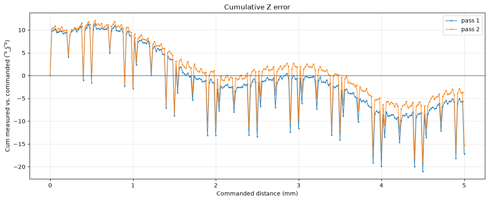

# lumos_RE
 Investigating remote control possibilities for WeCreat Lumos Ultra Laser Engraver

---

# Confirmed

## Network access

Observed defaults:

```text
SSH/FTP user:      mbtc
SSH/FTP password:  mbtc
HTTP API:          TCP/8080
Filesystem server: TCP/8082 (Mongoose 7.17)
OS:                Tina Linux (OpenWrt-derived, Allwinner SoC)
```

SSH:

```bash
ssh -o HostKeyAlgorithms=+ssh-rsa \
    -o PubkeyAcceptedAlgorithms=+ssh-rsa \
    mbtc@192.168.0.70
```

The service on **port 8082** exposes the root filesystem through a Mongoose file server.


## Interesting filesystem paths

```text
/etc/mbtc/                               machine configuration and calibration stuff
/etc/mbtc/sn.json                        factory serial number
/overlay/work/logfile.txt                mbtc_creater runtime log

/mnt/SDCARD/data/framing/gcode.gc        generated job G-code
/mnt/SDCARD/data/framing/framing_mode.gcode
/mnt/SDCARD/data/framing/framing_data.gcode

/usr/bin/mbtc_creater                    main local API / machine-control process

/mnt/UDISK/update.tar.gz                 staged OTA package
```

## curl http://192.168.0.70:8080/device/info

Example from app version `1.5.3`:

```json
{
    "app_version" : "1.5.3",
    "dev_type" : "LU25xx",
    "hostname" : "mbtc_#####",
    "laser_id" : "5w_uv",
    "name" : "wecreat",
    "sn" : "############",
    "soc_img_buildtime" : "tina.dev.20251225.084241",
    "ver_mcu_1" : "000241",
    "ver_mcu_2" : "120015",
    "wlan0_ip" : "192.168.0.70",
    "wlan0_mac" : "AA:AA:AA:AA:AA:AA"
}
```

## OEM software on Linux

The Windows WeCreat MakeIt application is Electron-based and can run under Bottles/Wine.

A currently known-working combination is:

```text
Runner:       Caffe 8.21
Launch flag:  --no-sandbox
DXVK disabled
```

---

# MOPA Modules

The MOPA Modules I received were in unmarked compact white enclosures, not what I expected from JPT. Their are no clear identifiers internally either. But various construction details, electronic pcb layouts and component choices look identical to regular size JPT M7 MOPAs. Finally an acquaintance with a connection to JPT was able to confirm that the MOPA sources are new  compact models that are currently only available for system builders on the Chinese market. So I am now very confident that genuine JPT products are delivered. Datasheets would still be very interesting to confirm if we get similar Joules and 100000 hour specified lifespans like regular size M7 boxes.


## MOPA Joules estimate

With no detailed info available for the WeCreat MOPA modules I want to know their max impulse energy. JPTs YDFLP-E2 series for example has a quirk where the 60W YDFLP-E2-60-M7-M-R source is specified 2mJ and the 100W YDFLP-E2-100-M7-M-R is specified only 1.5mJ. To find out if this is the same for the compact white JPT MOPAs I used an older Coherent J50LP-1A pyroelectric energy sensor, originally intended for much lower frequency pulsed IR lasers. It is labelled responsivity RV(@1064nm)=1.586E+2(V/J). I expect its thermal mass to integrate absorbed energy over a few fast MOPA pulses. It's not intended for this so, grain of salt etc.

### Measurement setup

- **Energy sensor:** Coherent J50LP-1A pyroelectric head
- **Responsivity:** `158.6 V/J @ 1064 nm`
- **Oscilloscope:** Rohde & Schwarz MXO44, 1 MΩ DC input
- Short laser vectors of varying lengths were programmed
- The absolute peak measurements include uncertain startup behaviors so the useful quantity is the difference between sensed energy plateaus

### WeCreat 100W MOPA module

```text
10 kHz
500 ns
S1000
Coherent J50LP-1A
5 shots per point
```

Measured median Vmax values:

| Duration | Median Vmax | Apparent burst energy |
|---:|---:|---:|
| 160 µs | 492.99 mV | 3.1084 mJ |
| 240 µs | 808.51 mV | 5.0978 mJ |

The two bursts differ by **315.52 mV**:

```text
ΔE ≈ 0.31552 V / 158.6 V/J ≈ 1.99 mJ
```

**Best guesstimate: Incognito 100 W JPT: ~2.0 mJ per added gated optical pulse.**


### WeCreat 60W MOPA module

```text
10 kHz
500 ns
S1000
Coherent J50LP-1A
5 shots per point
```

Measured median Vmax values:

| Duration | Median Vmax | Apparent burst energy |
|---:|---:|---:|
| 150 µs | 732.54 mV | 4.6188 mJ |
| 170 µs | 986.82 mV | 6.2221 mJ |

The two bursts differ by **254.28 mV**:

```text
ΔE ≈ 0.25428 V / 158.6 V/J ≈ 1.60 mJ
```

**Best guesstimate: Incognito 60 W JPT: ~1.6 mJ per added gated optical pulse.**


### Regular JPT YDFLP-E-60-M7-M-R

For comparison I also repeated the experiment with a regular full-size JPT M7 source of "known" specification.
This source is built into a machine with regular BJJCZ controller card, so there is some different timing behavior but same principles.

Model: YDFLP-E-60-M7-M-R

Specified maximum pulse energy: 1.5 mJ

```text
10 kHz
500 ns
S1000
Coherent J50LP-1A
5 shots per point
```

Measured median Vmax values:

| Duration | Median Vmax | Apparent burst energy |
|---:|---:|---:|
| 3991.32 µs | 397.10 mV | 2.5038 mJ |
| 4001.08 µs | 700.43 mV | 4.4163 mJ |

The two bursts differ by **303.33 mV**:

```text
ΔE ≈ 0.30333 V / 158.6 V/J ≈ 1.91 mJ
```

**Best guesstimate: Regular JPT YDFLP-E-60-M7-M-R: ~1.91 mJ per added gated optical pulse.**


### MOPA laser start transient / Time Constants

The MOPA source needs some time to reach set output power. If lazing and mirror movement start simultaneously, the beginning of a line is tapered: `<=====`
A better result was obtained by slowing the beam during the first ~110 µs after laser turn-on. The best discovered settings were:

* startup speed: **100 mm/s**
* startup duration: **~110 µs**
* startup distance: **~0.011 mm**
* normal marking speed after startup: **2400 mm/s**

The best sequence for avoiding over- and under-exposure of the edges was found at S300, 48 kHz, 30 ns, 2400 mm/s final speed:

```text
unpowered lead-in at 100 mm/s
→ laser ON at nominal vector start
→ continue 0.011 mm at 100 mm/s (~110 µs)
→ switch to normal marking speed
→ laser OFF at nominal vector end
→ unpowered lead-out
```

THis will be different at other speeds, power- and possibly pulse and frequency settings too, pretty complicated...
It does not establish the meanings of `M57` or `M59`.

---

# UV source control

This machine uses an unusual Raycus RFL-P5-355-S-A-U UV source with a "rear entrance" for coupling in a MOPA source.

## RS232 link

The 5 W UV source communicate with MCU1 over RS232:

```text
9600 baud
8 data bits
no parity
1 stop bit
CRLF-terminated ASCII commands
```
## UV standby / pump control

This was the main reason for this project. The older firmware left the UV source fully pumped whenever the engraver was powered on, even while using only the MOPA module. That caused roughly 100 W of unnecessary power consumption, cooling-fan noise, and unnecessary UV pump/crystal wear. After flashing ed658bb4e05c5a341dca7c98ba14b955.tar.gz on September 13 2026 using manual_firmware_update.py I am able to run query_mcu.py M43S0 to power down the UV laser source and query_mcu.py M43S1 to power it back up. Internally I believe this translates to mcu1 sending SS 0 or SS 1 to the UV source via RS232. Awesome!

The dev firmware containing MCU1 version `000241` adds a new `M43` handler:

```text
M43S0  ->  SS 0\r\n  -> UV source low-power / standby state
M43S1  ->  SS 1\r\n  -> UV source powered back up
```

Using the generic MCU command utility:

```bash
python3 query_mcu.py M43S0
python3 query_mcu.py M43S1
```

The same firmware also adds a not yet understood new MCode:

```text
M44 -> RVV\r\n
```

### Related MCU1 behavior

Firmware analysis also shows:

```text
M41S0 -> SPK1\r\n
M41S1 -> SPK0\r\n
```

This appears to control the UV source's equivalent of "first pulse killer" or something like that?


## UV 3D glass engraving

The 355nm laser supports subsurface engraving. Together with the motorized Z-axis we can embed 3D models in glass blocks!

OEM-Software-generated jobs show:

```text
M18S2          select 355 nm UV
M38F80         80 kHz
G5T70S1000     configure subsurface point marking
G5X...Y...     emit one crystal voxel
```

For a 90mm tall glass block on OEM default riser with refractive index n=1.516:

```text
glass top Zmachine = 99.400 mm

Zmachine = 99.400 - depth / 1.516
```

---


# Firmware update notes

Vendor update feeds:

```text
https://package.wecreat.com/lumos-pro/test.txt
https://package.wecreat.com/lumos-pro/dev.txt
( https://package.wecreat.com/lumos-pro/version.json )
```


Files seen in the last few months:

```text
    https://package.wecreat.com/lumos-pro/test.txt
    https://package.wecreat.com/lumos-pro/224ba7007723fd804633114686eac904.tar.gz

    https://package.wecreat.com/lumos-pro/dev.txt
    https://package.wecreat.com/lumos-pro/5035695862f8e56b3ad871f9ac5a1e9e.tar.gz
    https://package.wecreat.com/lumos-pro/4756e18225fd1c4fbe5d6dffb329fa0f.tar.gz
    https://package.wecreat.com/lumos-pro/b698c91f4f73260f9c56488abee08d82.tar.gz
    https://package.wecreat.com/lumos-pro/679d452c15a3f9876959465f006944e3.tar.gz
    https://package.wecreat.com/lumos-pro/ed658bb4e05c5a341dca7c98ba14b955.tar.gz
    https://package.wecreat.com/lumos-pro/86b535bca1f48390a4baf7be0c42cf7d.tar.gz

```
After flashing firmware with manual_firmware_update.py, a power cycle is needed for the machine to report íts new versions. Careful here, brickage likely not impossible.


---


# G-code file retention / descriptor leak

`mbtc_creater` appears to stream `gcode.gc` from disk, but does not close old files when its done.

```text
current job:
  /mnt/SDCARD/data/printing/gcode.gc

after completion / replacement:
  /mnt/SDCARD/data/printing/gcode.gc (deleted)
```

Old jobs remain referenced through `/proc/<mbtc_creater PID>/fd/` as deleted-but-open files.

Repeated large jobs can accumulate hidden storage usage even though `/mnt/SDCARD/data/printing` appears empty.

Useful inspection commands:

```sh
PID=$(pidof mbtc_creater)

ls -l /proc/$PID/fd | grep gcode

for f in /proc/$PID/fd/*; do
    target=$(readlink "$f")
    case "$target" in
        *gcode.gc*)
            ls -liL "$f"
            cat /proc/$PID/fdinfo/${f##*/}
            ;;
    esac
done
```

The active job's `fdinfo` `pos:` value also advances during engraving providing a simple playback-progress bar.

For very large jobs I would recommend multiple resumable Z slice rather than one ginormous file. And a restart occasionally maybe.


---


# Local HTTP API

Endpoints found in `/usr/bin/mbtc_creater` include:

## Device

```text
/device/info
/device/heartbeat
/device/set_config
/device/set_device_type
/device/set_wlan0_mac
/device/set_factory_sn
/device/sys_restart
/device/set_inverse_dis
/device/laser_led_switch
/device/global/cfg_peripheral_status
```

## Camera

```text
/camera/take_photo
/camera/measure_distance
/camera/get_calibration
/camera/measure_material_thick

/device/camera/factory_upload
/device/camera/factory_download
/device/camera/upload
/device/camera/download

/lumos/camera/start_autofocus
/lumos/camera/stop_autofocus
```

## Material / jobs

```text
/device/material/upload
/device/material/download

/process/upload
/process/multipart
/process/fileupload_via_ftp
/process/start
/process/control
/process/status
/process/door_status
```

## Lighting

```text
/device/light/status
/device/light/progress
/device/light/focus_light
/device/light/logo_light
/device/light/get_init_value
```

The OEM application reports PWM-controlled peripherals including:

```text
frontlight
backlight
servo
```

## Direct command endpoints

Useful reverse-engineering endpoints include:

```text
/test/cmd/mcu
/test/cmd/rs485
```

The MCU endpoint expects the command  plus a matching uppercase MD5 query parameter.

---


# Controller / serial architecture

## `/dev/ttyS2`

onnects to the secondary controller responsible for at least:

- Z-axis motion
- physical start-button supervision

## `/dev/ttyS4`

Connects to MCU1, a GD32F407 in LQFP144.

Observed boot/default baud rate:

```text
500000 baud
```

The UV source RS232 path reaches MCU1 as follows:

```text
UV TX -> level shifter -> GD32F407 pin 116 / PD2
UV RX <- level shifter <- GD32F407 pin 113 / PC12
```

These pins correspond to UART5 in the STM32/GD32 peripheral mapping.


## Z-axis layer-spacing error

While optimizing 3D glass engraving, I found that the Z axis does not move in uniform increments, even when commanded with regular Z positions. External measurement shows discrete Z increments on a 5µm lattice. But individual moves can be substantially shorter or longer than requested, while the long-term average remains correct. The microcontroller in charge of the Z axis, mcu2.bin, uses a 5 µm pitch while somebody upstream in the chain of command creatively rounds to 10µm.

<a href="./images/cumulative_z_error.png">
  
</a>

The upstream actor can be bypassed entirely and Z-commands can be injected into the RS485 bus directly with something like this for a 95.400mm command. IEEE-754 32-bit float number surrounded by some extras.
```text
printf '\x00\x19\x42\xBE\xCC\xCD\x03' | \
curl -sS --data-binary @- \
    http://192.168.0.70:8080/test/cmd/rs485
```

---

# MCU commands

## Pretty sure

| Command | Function / observation |
|---|---|
| `$H0` | Home Z axis and remain at home |
| `$H1` | Home Z axis and return to previous position |
| `$RST` | Reset MCU |
| `$GETVER` | Doesn't work through http API, maybe only asked once during boot? |
| `M27` | Position query returns M27 Z104.840 X0.000 U0.000 B0.000 |
| `M22` | I thought it was door sensor but it doesn't seem to be (any more?) |
| `M29` | Returns M29S3Q1 |
| `M15 S0..100` | Exhaust fan speed |
| `M38 F...` | Pulse frequency, kHz |
| `M39 P...` | Pulse width, ns |
| `M3 S...` | Constant laser power mode |
| `M4 S...` | Speed-proportional laser power mode |
| `M41S0/1` | UV PulseKill mode; maps to `SPK1` / `SPK0` respectively |
| `M43S0/1` | UV source standby / wake; maps to `SS 0` / `SS 1` |
| `M44` | Sends UV-source query `RVV` |


Motion/G-code conventions:

```text
G0 / G1                 movement
F value                  mm/min (mm/s * 60)
S value                  laser power, apparently 0..1000
G4 P1                    1 second requested dwell (verification pending)
```

Additional strings of interest that need figuring out:

```text
M134S1
M134S0
M33Y1
M33Y0
M107
$GETID
$SH1
$SH0
M54S0
M54S1
M40S0
M3
```

## LightBurn profile clues

From a LightBurn `.lbdev` profile:

```json
"Macro0_Content": "M18S1\n",
"Macro0_Label": "455Blue",
"Macro3_Content": "M18S0\n",
"Macro3_Label": "1064red"
```

This suggests `M18` is related to source/optical-path selection.

---

# Process state and job control

Observed `/process/status` values:

```text
2 = busy / working
3 = job finished but still loaded/armed? (exact semantics not fully confirmed)
4 = waiting / idle
6 = preview tracing
```

A job waiting for the physical start-button press can be started with press_physical_start_button.py or:

```bash
curl -X POST http://192.168.0.70:8080/process/start
```

This will mercilessly start whatever file is "armed", so make sure there are no eyes or flammables in the working volume.

Replacing the G-code file on disk is not enough: We must load/arm that
file before start, otherwise a previous job can run. The working sequence is:

1. Upload `/mnt/SDCARD/data/printing/gcode.gc`.
2. POST `/process/fileupload_via_ftp` with the file's uppercase MD5 and the
   arming payload used in `engrave_MOPA_mode.py`.
3. POST `/process/start` (or press the physical start button).

---

# GPIO notes

Front RGB LED:

```bash
# blue
echo 0 > /sys/class/gpio/gpio114/value

# red
echo 0 > /sys/class/gpio/gpio115/value

# green
echo 0 > /sys/class/gpio/gpio116/value
```

Focus-assist red lasers:

```bash
# front
echo 0 > /sys/class/gpio/gpio113/value

# front-left
echo 0 > /sys/class/gpio/gpio112/value
```

There's some very annoying coil whine associated with the interior lighting, it's usually noisy mirror drivers, not here! disable_interior_lights.py or old operator age takes care of that.

---

# TODO / Future investigations

There is still a lot of functionality in the Lumos Ultra that has not been fully understood or exposed outside the OEM software.

- [ ] **Commands**
  - Analyze generated gcodes and complete the [dictionary](docs/gcode-dictionary.md)
  - Identify what can do / query during processing
  - Find out if there is a machine family that speaks a similar language, maybe we can gcode generation in meerk40t with lowish effort?
  - There should be a query that verifies whether the UV source is ready to pew pew

- [ ] **Camera**
  - Document the camera API and available controls
  - Determine whether exposure, gain, white balance, etc. can be controlled
  - Locate + document factory and user camera calibration
  - Camera-based automated research of MOPA Color engraving?!

- [ ] **Manual Z-height adjustment knob**
  - Document the calibration function for it maybe

- [ ] **Field-lenses**
  - Determine where per-machine and/or per-lens field-correction calibration is stored.
  - Determine whether correction is performed in MakeIt before G-code generation, by `mbtc_creater`, or by the MCU during playback.
  - Extract the de-distort model and make it usable by third-party software
  - Figure out automatic field-lens detection if implemented in my prototype machine at all
  - Find the working-area dimensions and correction data associated with all supported lens
  - Investigate whether new other custom F-theta lenses can be used

- [ ] **Accessories**
  - Document the gcode used by the rotary attachment and linear slider extension
  - Identify the two additional stepper-motor channels and their corresponding MCU/G-code commands.
  - Determine axis scaling, homing, limits, and accessory-detection mechanisms

- **Timing compensation**
  - FW analysis has identified [M57 parameter storage and M59 queued parameters](docs/gcode-dictionary.md#timing-compensation-investigation); what do they do?
  - Laser-on, laser-off, jump, polygon or similar timing constants have to be in gcode right?
  - Is the GD32 and representation in gocde sufficiently "agile" accomodate hardware behavior perfectly?
  - Expose these parameters if possible; accurate timing is particularly important for high-pass-count precision work such as PCB structuring.
  - What's the time resolution of the gcode planner? How long does a gcode run if it has a million calls to G4P0.000001? How long if it hasa thousand calls to G4P0.001?

- [ ] **Peripherals**
  - `/device/light/get_init_value`?
  - What does the `servo` PWM channel control?

- [ ] **Configuration and calibration storage**
  - Lots of interesting files in `/etc/mbtc/`.
  - Which values are factory calibration, user configuration, machine identity, or replaceable defaults?

- [ ] **Network/privacy behaviour**
  - What's the OEM application's downloaded `tracking.xlsx` / `tracking.db`?

- [ ] **Workpiece height measurement** postponed because seemingly not yet implemented
  - Reverse engineer the intended autofocus system using the two red focus-assist laser points
  - Investigate `/lumos/camera/start_autofocus`, `/lumos/camera/stop_autofocus`, `/camera/measure_distance`, and related MCU commands
  - Find out whether the unfinished/prototype autofocus implementation can be made reliable

- [ ] **Subsystems
  - mcu1 is the gcode interpreter, galvo mirror and mopa controller
  - mcu2 is doing non-time-critical tasks such as z-height stepper control and watching the job-start-push-button
  - we have identified some more control words and responses for the Raycus UV source. Can we maybe listen in on the rs232 communication again see if there are more new ones?

---
